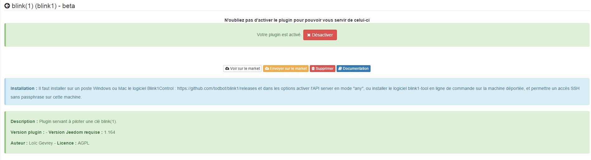
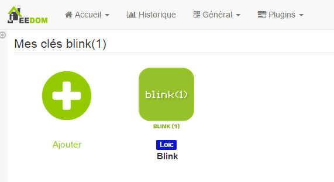
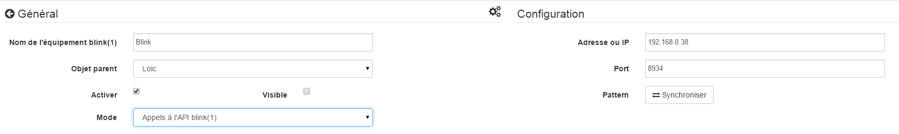

Beschreibung 
===========

.

Konfiguration 
=============

Das Plugin benötigt keine Konfiguration, Sie müssen es nur aktivieren :

Gerätekonfiguration 
=============================

Plugins-Menü :

Ausrüstung) :

:

> **Spitze**
>
> Setzen Sie die Maus wie an vielen Stellen auf Jeedom ganz links
> ruft ein Schnellzugriffsmenü auf (Sie können
> von deinem Profil immer sichtbar lassen).

Hier finden Sie die gesamte Konfiguration Ihrer Geräte :

-   **** : 

-   **Übergeordnetes Objekt** : gibt das übergeordnete Objekt an, zu dem es gehört
    Ausrüstung

-   **Aktivieren** : macht Ihre Ausrüstung aktiv

-   **Sichtbar** : macht es auf dem Dashboard sichtbar

-   **Modus** : 
    

 :

-   Der im Dashboard angezeigte Name

-   Typ und Subtyp

-   der Wert : ermöglicht es, den Wert der Bestellung entsprechend anzugeben
    ,
    .

-   Einstellungen : 

-   Anzeige : ermöglicht die Anzeige der Daten im Dashboard

-   erweiterte Konfiguration (kleine gekerbte Räder) : Anzeigen
    die erweiterte Konfiguration des Befehls (Methode
    Geschichte, Widget…)

-   Test : Wird zum Testen des Befehls verwendet

-   löschen (unterschreiben -) : ermöglicht das Löschen des Befehls

" 
============

.

" 
------------------------------

.

 :

-   **** : 

-   **Hafen** : 

-   **Muster** : 
    

 
-------------------------------------------

[ici](http://blink1.thingm.com/blink1control/), dans la partie download,
. 
.

 
--------------------------------------------

 :

. 

.

. 
.

.

" 
===========================

 X
.

. .

> **Wichtig**
>
> 
> . 
> 
> . 
> .

"

. 
.

" 
===============

. 

".

" 
==========

. 
 :

-   **** : 
    

-   **** : 

-   **Benutzername** : 
    

-   **** : 
    

> **Spitze**
>
> 
> [ici](https:// github.
> 
> ,
> . 
> 
> 

> **Wichtig**
>
> 
> 
> .
