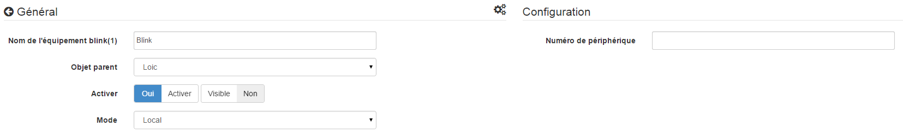

Beschreibung 
===========

Plugin zur Steuerung eines Blinkschlüssels (1).

Konfiguration 
=============

Das Plugin benötigt keine Konfiguration, Sie müssen es nur aktivieren :

Gerätekonfiguration 
=============================

Auf die Konfiguration der Blinkgeräte (1) kann über die zugegriffen werden
Plugins-Menü :

So sieht die Plugin-Seite blink (1) aus (hier mit bereits a
Ausrüstung) :

So sieht die Konfigurationsseite für ein Blinkgerät aus (1)
:

> **Tip**
>
> Setzen Sie die Maus wie an vielen Stellen auf Jeedom ganz links
> ruft ein Schnellzugriffsmenü auf (Sie können
> von deinem Profil immer sichtbar lassen).

Hier finden Sie die gesamte Konfiguration Ihrer Geräte :

-   **Name der Blinkausrüstung (1)** : Name Ihrer Blinkausrüstung (1)

-   **Übergeordnetes Objekt** : gibt das übergeordnete Objekt an, zu dem es gehört
    Ausrüstung

-   **Activer** : macht Ihre Ausrüstung aktiv

-   **Visible** : macht es auf dem Dashboard sichtbar

-   **Mode** : den Modus, in dem Sie arbeiten möchten
    Ihr Blinken (1) (Beschreibung siehe unten)

Nachfolgend finden Sie die Liste der Bestellungen :

-   Der im Dashboard angezeigte Name

-   Typ und Subtyp

-   der Wert : ermöglicht es, den Wert der Bestellung entsprechend anzugeben
    ein anderer Befehl, ein Schlüssel (Fall eines virtuellen Schalters),
    einer Berechnung….

-   Einstellungen : Name des zu startenden Musters oder des zu startenden Befehls

-   Anzeige : ermöglicht die Anzeige der Daten im Dashboard

-   erweiterte Konfiguration (kleine gekerbte Räder) : Anzeigen
    die erweiterte Konfiguration des Befehls (Methode
    Geschichte, Widget…)

-   Test : Wird zum Testen des Befehls verwendet

-   löschen (unterschreiben -) : ermöglicht das Löschen des Befehls

"Lokaler" Modus" 
============

Zu verwendender Modus, wenn das Blinken (1) an einen der USB-Anschlüsse von angeschlossen ist
Jeedom. Der einzige Parameter in diesem Modus ist nicht obligatorisch und erlaubt
Wählen Sie einen Blink (1), insbesondere wenn Sie mehr als einen haben
trendy.

Blink-API-Aufrufmodus (1)" 
------------------------------

In diesem Modus ruft Jeedom die blink1control-API direkt auf
Jeedom muss daher in der Lage sein, sich direkt dem System anzuschließen, auf dem die
Blinkschlüssel (1) ist installiert.

In diesem Modus sind die Konfigurationsparameter :

-   **Adresse oder IP** : Adresse oder IP, an der der Blinkschlüssel (1) installiert ist

-   **Port** : Port, an dem die Anwendung blink1control empfangsbereit ist

-   **Pattern** : ermöglicht es, die Muster mit denen von zu synchronisieren
    blink1control App

Installation der Anwendung blink1control 
-------------------------------------------

Die blink1control App ist zu finden
[hier](http://blink1.thingm.com/blink1control/), im Download-Bereich,
Es ist für Windows und Mac verfügbar. Nach dem Herunterladen starten
Installation der Anwendung.

Konfiguration der Anwendung blink1control 
--------------------------------------------

Einmal installiert und gestartet müssen Sie haben :

Diese Anwendung bietet viele Möglichkeiten. Schnell wir
Oben links finden Sie den Status des Schlüssels (hier nicht verbunden) unten
Ereignisse auf der linken Seite, oben in der Mitte der schnellen Aktionen zu
Steuern Sie die Taste direkt unter einem erweiterten Modusauswahlsystem
und Farben und rechts die Muster.

Dort klicken Sie auf das kleine Zahnrad im Gerät, um
Rufen Sie das erweiterte Konfigurationsmenü auf und aktivieren Sie die API
Server, ServerHost auf einen beliebigen setzen. Beachten Sie auch den Anschluss für die
Bericht in der Konfiguration von Jeedom.

Überprüfen Sie blink1control und starten Sie es neu, damit es berücksichtigt wird.

"URL-Überwachungsmodus" 
===========================

In diesem Modus ruft die Anwendung blink1control alle auf X
Sekunden diese URL, die ihm seine Anweisungen gibt.

Um es zu konfigurieren, gehen Sie in der Anwendung blink1control zu
Klicken Sie dann auf das kleine Extra (+), um eines hinzuzufügen
URL erstellen und die von Jeedom angegebene URL kopieren (zu beobachtende URL-Felder)
auf dem Weg. Sie können auch die Aktualisierungshäufigkeit konfigurieren.

> **Important**
>
> Damit dies funktioniert, muss der PC, auf dem blink1control installiert ist
> kann auf Jeedom zugreifen. Wenn Sie draußen einen Laptop benutzen
> von Ihrem Netzwerk mit dem Schlüssel darauf, also muss Jeedom sein
> von außen zugänglich. Wenn Sie nicht wissen wie,
> Besser ist es, Jeedom DNS zu verwenden.

In diesem Modus haben Sie auch die Option "Befehle nicht wiederholen""
Dadurch ist es möglich, den letzten Befehl nicht mehr einmal zu wiederholen
blink1control hat die Anfrage berücksichtigt. Es ist ratsam zu
verlassen überprüft.

"Beide" -Modus" 
===============

Dieser Modus ist eine Kombination der beiden vorherigen Modi, der Vorteil ist
dass es die Reaktionsgeschwindigkeit des ersteren und die Möglichkeit von kombiniert
arbeiten auch außerhalb des zweiten Hauses. Für die
Befolgen Sie bei der Konfiguration die Anweisungen unter "Anrufe an
blink (1) API "- und" URL-Überwachungsmodus".

SSH-Modus" 
==========

Dieser Modus sollte verwendet werden, wenn Sie das Blinken (1) auf eine Maschine gesetzt haben
Linux anders als das, in dem Jeedom installiert ist (Jeedom Master, weil das
Plugin ist in Remote nicht kompatibel). Die Konfiguration ist recht
einfach :

-   **Gerätenummer** : Geräte-ID, nur zu verwenden, wenn
    Sie haben mehrere Blinktasten (1) auf Ihrem Computer

-   **Adresse oder IP** : IP-Adresse des Geräts, an dem der Schlüssel angeschlossen ist

-   **Benutzername** : Der Benutzername, bei dem Sie sich anmelden möchten
    die Maschine, an der der Schlüssel angeschlossen ist

-   **Relativer Pfad der ausführbaren Datei des blink1-Tools** : relativer Weg zu
    die ausführbare Datei blink1-tool

> **Tip**
>
> Die ausführbare Datei ist verfügbar
> [hier](https://github.com/todbot/blink1/releases), Sei vorsichtig, Jeedom, tu es nicht
> funktioniert nur mit der Linux-Version, die natürlich kompatibel ist
> als mit einer Linux-Maschine (RPI, RPI2, Jeedomboard, Cubieboard,
> Bananapi…). Übertragen Sie einfach die ausführbare Datei auf den Computer, auf dem
> ist in den Schlüssel eingesteckt und macht ihn ausführbar (chmod + x
> blink1-tool)

> **Important**
>
> Damit dies funktioniert, müssen Sie auf SSH-Ebene implementiert haben
> den Austausch von RSA-Schlüsseln, damit Jeedom eine Verbindung zum herstellen kann
> Maschine, an der der Schlüssel ohne Angabe eines Passworts eingesteckt ist.
