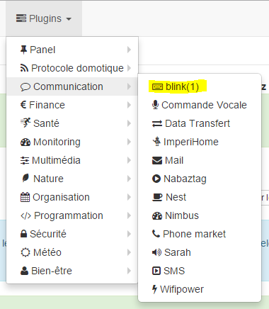

Description 
===========

.

Setup 
=============

The plugin does not require any configuration, you just have to activate it :

Equipment configuration 
=============================

Plugins menu :

equipment) :

:

> **Tip**
>
> As in many places on Jeedom, put the mouse on the far left
> brings up a quick access menu (you can
> from your profile always leave it visible).

Here you find all the configuration of your equipment :

-   **** : 

-   **Parent object** : indicates the parent object to which belongs
    equipment

-   **Activate** : makes your equipment active

-   **Visible** : makes it visible on the dashboard

-   **Fashion** : 
    

 :

-   the name displayed on the dashboard

-   type and subtype

-   the value : allows to give the value of the order according
    ,
    .

-   Settings : 

-   Show : allows to display the data on the dashboard

-   advanced configuration (small notched wheels) : Displays
    the advanced configuration of the command (method
    history, widget…)

-   Test : Used to test the command

-   delete (sign -) : allows to delete the command

" 
============

.

" 
------------------------------

.

 :

-   **** : 

-   **Port** : 

-   **** : 
    

 
-------------------------------------------

[ici](http://blink1.thingm.com/blink1control/), dans la partie download,
. 
.

 
--------------------------------------------

 :

. 

.

. 
.

.

" 
===========================

 X
.

. .

> **Important**
>
> 
> . 
> 
> . 
> .

"

. 
.

" 
===============

. 

".

" 
==========

. 
 :

-   **** : 
    

-   **** : 

-   **Username** : 
    

-   **** : 
    

> **Tip**
>
> 
> [ici](https:// github.
> 
> ,
> . 
> 
> 

> **Important**
>
> 
> 
> .
