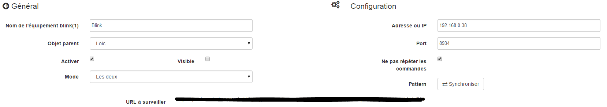

Description 
===========

Plugin used to control a blink key (1).

Setup 
=============

The plugin does not require any configuration, you just have to activate it :

Equipment configuration 
=============================

The configuration of blink devices (1) is accessible from the
Plugins menu :

This is what the blink (1) plugin page looks like (here with already a
equipment) :

This is what the configuration page for a blink device looks like (1)
:

> **Tip**
>
> As in many places on Jeedom, put the mouse on the far left
> brings up a quick access menu (you can
> from your profile always leave it visible).

Here you find all the configuration of your equipment :

-   **Name of the blink(1) equipment** : name of your blink equipment (1)

-   **Parent object** : indicates the parent object to which belongs
    equipment

-   **Activer** : makes your equipment active

-   **Visible** : makes it visible on the dashboard

-   **Mode** : the mode in which you want to operate
    your blink (1) (see below for description)

Below you find the list of orders :

-   the name displayed on the dashboard

-   type and subtype

-   the value : allows to give the value of the order according
    another command, a key (case of a virtual switch),
    of a calculation….

-   Settings : name of the pattern to launch or of the command to launch

-   Show : allows to display the data on the dashboard

-   advanced configuration (small notched wheels) : Displays
    the advanced configuration of the command (method
    history, widget…)

-   Test : Used to test the command

-   delete (sign -) : allows to delete the command

"Local" mode" 
============

Fashion to use if the blink (1) is connected to one of the USB ports of
Jeedom. The only parameter in this mode is not mandatory and allows to
select a blink (1) in particular if you have more than one
trendy.

Blink API Calls Fashion (1)" 
------------------------------

In this mode, Jeedom will directly call the blink1control API, it
Jeedom must therefore be able to directly join the system on which the
blink key (1) is installed.

In this mode the configuration parameters are :

-   **Address or IP** : address or ip where the blink key (1) is installed

-   **Port** : port on which the blink1control application is listening

-   **Pattern** : allows to synchronize the patterns with those of
    blink1control app

Installation of the blink1control application 
-------------------------------------------

The blink1control app can be found
[here](http://blink1.thingm.com/blink1control/), in the download section,
it is available for windows and mac. Once downloaded, launch
installing the application.

Setup of the blink1control application 
--------------------------------------------

Once installed and launched you must have :

This application offers many possibilities. Quickly we
find on the top left the status of the key (here not connected), below
events on the left, at the top in the center of rapid actions to
control the key, just below an advanced mode selection system
and colors, and on the right the patterns.

Once there, click on the small gear wheel in device to
bring up the advanced configuration menu and activate the API
server, putting serverHost on any. Also note the port for the
report in the configuration of Jeedom.

Validate and restart blink1control so that it takes it into account.

"URL monitoring mode" 
===========================

In this mode it is the blink1control application which calls all the X
seconds this URL which will give it its instructions.

To configure it, in the blink1control application go to
tools then click on the little extra (+) to add one, then
make URL and copy the URL given by Jeedom (URL fields to watch)
in the path. You can also configure the update frequency.

> **Important**
>
> For this to work, the PC on which blink1control is installed
> can access Jeedom. If you use a laptop outside
> of your network with the key on it, so Jeedom must be
> accessible from outside. If you don't know how,
> better is to use Jeedom DNS.

In this mode you also have an option "Do not repeat commands"
this makes it possible to no longer repeat the last command once
blink1control has taken into account the request. It is advisable to
leave checked.

"Both" mode" 
===============

This mode is a combination of the 2 previous modes, the advantage is
that it combines the reaction speed of the former and the possibility of
operate even outside the second home. For the
configuration, follow the procedures for the "Calls to
blink (1) API "and" URL Monitoring mode".

SSH mode" 
==========

This mode should be used if you have put the blink (1) on a machine
linux other than the one where Jeedom is installed (Jeedom master because the
plugin is not compatible in remote). The configuration is quite
simple :

-   **Device number** : Device ID, to be used only if
    you have several blink keys (1) on your machine

-   **Address or IP** : IP address of the machine where the key is connected

-   **Username** : the username to log in to
    the machine where the key is connected

-   **Relative path to blink(1)-tool software** : relative path to
    the blink1-tool executable

> **Tip**
>
> The executable is available
> [here](https://github.com/todbot/blink1/releases), be careful Jeedom don't
> only works with the linux version which is of course compatible
> than with a linux type machine (rpi, rpi2, jeedomboard, cubieboard,
> bananapi…). Just transfer the executable to the machine where
> is plugged in the key, and make it executable (chmod + x
> blink1-tool)

> **Important**
>
> For this to work, you must have implemented at SSH level
> the exchange of RSA keys so that Jeedom can connect to the
> machine where the key is plugged in without providing a password.
