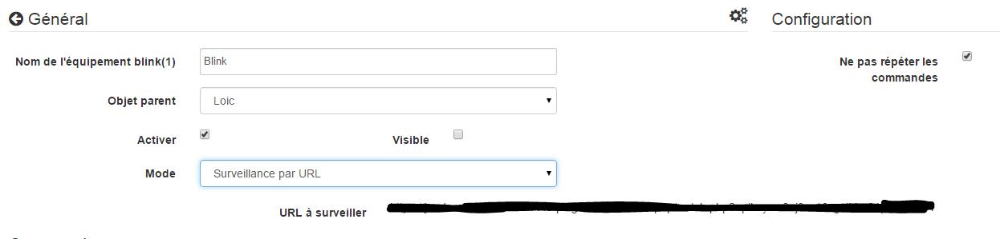
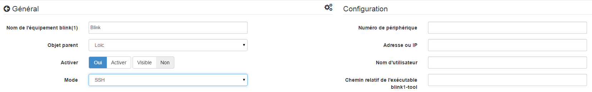

Descripción 
===========

Complemento utilizado para controlar una tecla de parpadeo (1).

Configuración 
=============

El complemento no requiere ninguna configuración, solo tiene que activarlo :

Configuración del equipo 
=============================

Se puede acceder a la configuración de los dispositivos de parpadeo (1) desde
Menú de complementos :

Así es como se ve la página del complemento blink (1) (aquí con un
equipos) :

Así es como se ve la página de configuración para un dispositivo de parpadeo (1)
:

> **Punta**
>
> Como en muchos lugares de Jeedom, coloca el mouse en el extremo izquierdo
> abre un menú de acceso rápido (puedes
> desde tu perfil siempre déjalo visible).

Aquí encontrarás toda la configuración de tu equipo :

-   **Nombre del equipo de parpadeo (1)** : nombre de su equipo de parpadeo (1)

-   **Objeto padre** : indica el objeto padre al que pertenece
    equipo

-   **Activar** : activa su equipo

-   **Visible** : lo hace visible en el tablero

-   **Modo** : el modo en el que desea operar
    su parpadeo (1) (consulte la descripción a continuación)

A continuación encontrará la lista de pedidos. :

-   el nombre que se muestra en el tablero

-   tipo y subtipo

-   el valor : permite dar el valor del pedido según
    otro comando, una tecla (caso de un interruptor virtual),
    de un cálculo ....

-   Configuraciones : nombre del patrón para iniciar o del comando para iniciar

-   Mostrar : permite mostrar los datos en el tablero

-   configuración avanzada (ruedas con muescas pequeñas) : Muestra
    La configuración avanzada del comando (método
    historia, widget ...)

-   Probar : Se usa para probar el comando

-   eliminar (firmar -) : permite eliminar el comando

Modo "Local"" 
============

Modo a utilizar si el parpadeo (1) está conectado a uno de los puertos USB de
Jeedom El único parámetro en este modo no es obligatorio y permite
seleccione un parpadeo (1) en particular si tiene más de uno
de moda.

Modo de llamadas API parpadeante (1)" 
------------------------------

En este modo, Jeedom llamará directamente a la API blink1control, se
Por lo tanto, Jeedom debe poder unirse directamente al sistema en el que
la tecla de parpadeo (1) está instalada.

En este modo, los parámetros de configuración son :

-   **Dirección o IP** : dirección o ip donde está instalada la tecla de parpadeo (1)

-   **Puerto** : puerto en el que escucha la aplicación blink1control

-   **Patrón** : permite sincronizar los patrones con los de
    aplicación blink1control

Instalación de la aplicación blink1control 
-------------------------------------------

La aplicación blink1control se puede encontrar
[aquí](http://blink1.thingm.com/blink1control/), en la sección de descargas,
Está disponible para Windows y Mac. Una vez descargado, inicie
instalar la aplicación.

Configuración de la aplicación blink1control 
--------------------------------------------

Una vez instalado y lanzado debe tener :

Esta aplicación ofrece muchas posibilidades.. Rápidamente nosotros
encuentre en la parte superior izquierda el estado de la clave (aquí no conectado), debajo
eventos a la izquierda, en la parte superior en el centro de acciones rápidas para
controlar la tecla, justo debajo de un sistema de selección de modo avanzado
y colores, y a la derecha los patrones.

Una vez allí, haga clic en la pequeña rueda dentada en el dispositivo para
abrir el menú de configuración avanzada y activar la API
servidor, poniendo serverHost en cualquier. También tenga en cuenta el puerto para el
informe en la configuración de Jeedom.

Valide y reinicie blink1control para que lo tenga en cuenta.

"Modo de monitoreo de URL" 
===========================

En este modo, es la aplicación blink1control la que llama a todos los X
segundos esta URL que le dará sus instrucciones.

Para configurarlo, en la aplicación blink1control vaya a
herramientas, luego haga clic en el pequeño extra (+) para agregar uno, luego
crear URL y copiar la URL dada por Jeedom (campos URL para ver)
en el camino. También puedes configurar la frecuencia de actualización.

> **Importante**
>
> Para que esto funcione, la PC en la que está instalado blink1control
> puede acceder a Jeedom. Si usa una computadora portátil afuera
> de su red con la clave, por lo que Jeedom debe ser
> accesible desde afuera. Si no sabes cómo,
> mejor es usar Jeedom DNS.

En este modo también tiene la opción "No repetir comandos"
esto hace posible que ya no se repita el último comando una vez
blink1control ha tenido en cuenta la solicitud. Es aconsejable
dejar marcado.

Modo "Ambos"" 
===============

Este modo es una combinación de los 2 modos anteriores, la ventaja es
que combina la velocidad de reacción de los primeros y la posibilidad de
operar incluso fuera de la segunda casa. Para la
configuración, siga los procedimientos para las "Llamadas a
blink (1) API "y" Modo de monitoreo de URL".

Modo SSH" 
==========

Este modo debe usarse si ha puesto el parpadeo (1) en una máquina
Linux distinto del que está instalado Jeedom (Jeedom master porque el
el complemento no es compatible en remoto). La configuración es bastante
sencillo :

-   **Número de dispositivo** : ID del dispositivo, para usar solo si
    tiene varias teclas de parpadeo (1) en su máquina

-   **Dirección o IP** : Dirección IP de la máquina donde está conectada la llave

-   **Nombre de usuario** : el nombre de usuario para iniciar sesión
    la máquina donde está conectada la llave

-   **Ruta relativa del ejecutable blink1-tool** : camino relativo a
    el ejecutable de la herramienta blink1

> **Punta**
>
> El ejecutable está disponible.
> [aquí](https://github.com/todbot/blink1/releases), ten cuidado Jeedom no
> solo funciona con la versión de Linux, que por supuesto es compatible
> que con una máquina tipo Linux (rpi, rpi2, jeedomboard, cubieboard,
> bananapi ...). Simplemente transfiera el ejecutable a la máquina donde
> está enchufado en la clave y lo hace ejecutable (chmod + x
> blink1-tool)

> **Importante**
>
> Para que esto funcione, debe haber implementado a nivel SSH
> el intercambio de claves RSA para que Jeedom pueda conectarse al
> máquina donde se conecta la llave sin proporcionar una contraseña.
