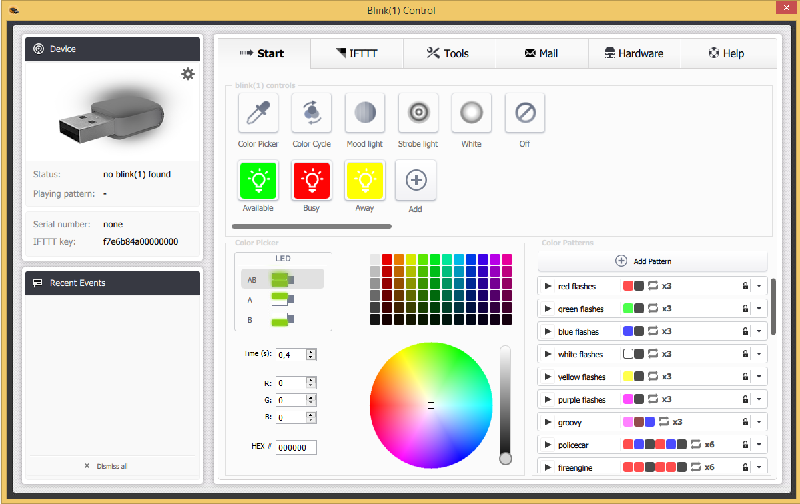

Descripción 
===========

.

Configuración 
=============

El complemento no requiere ninguna configuración, solo tiene que activarlo :

Configuración del equipo 
=============================

Menú de complementos :

equipos) :

:

> **Punta**
>
> Como en muchos lugares de Jeedom, coloca el mouse en el extremo izquierdo
> abre un menú de acceso rápido (puedes
> desde tu perfil siempre déjalo visible).

Aquí encontrarás toda la configuración de tu equipo :

-   **** : 

-   **Objeto padre** : indica el objeto padre al que pertenece
    equipo

-   **Activar** : activa su equipo

-   **Visible** : lo hace visible en el tablero

-   **Modo** : 
    

 :

-   el nombre que se muestra en el tablero

-   tipo y subtipo

-   el valor : permite dar el valor del pedido según
    ,
    .

-   Configuraciones : 

-   Mostrar : permite mostrar los datos en el tablero

-   configuración avanzada (ruedas con muescas pequeñas) : Muestra
    La configuración avanzada del comando (método
    historia, widget ...)

-   Probar : Se usa para probar el comando

-   eliminar (firmar -) : permite eliminar el comando

" 
============

.

" 
------------------------------

.

 :

-   **** : 

-   **Puerto** : 

-   **Patrón** : 
    

 
-------------------------------------------

[ici](http://blink1.thingm.com/blink1control/), dans la partie download,
. 
.

 
--------------------------------------------

 :

. 

.

. 
.

.

" 
===========================

 X
.

. .

> **Importante**
>
> 
> . 
> 
> . 
> .

"

. 
.

" 
===============

. 

".

" 
==========

. 
 :

-   **** : 
    

-   **** : 

-   **Nombre de usuario** : 
    

-   **** : 
    

> **Punta**
>
> 
> [ici](https:// github.
> 
> ,
> . 
> 
> 

> **Importante**
>
> 
> 
> .
