Descrição 
===========

Plugin usado para controlar uma tecla intermitente (1).

Configuração 
=============

O plugin não requer nenhuma configuração, você apenas precisa ativá-lo :

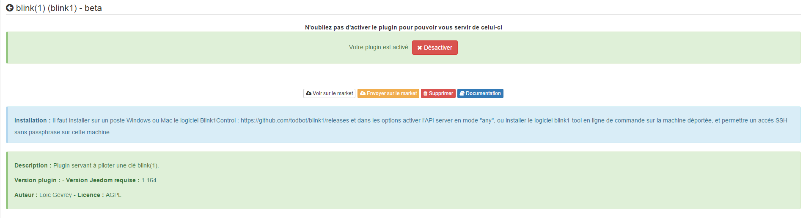

Configuração do equipamento 
=============================

A configuração dos dispositivos intermitentes (1) é acessível a partir do
Menu de plugins :

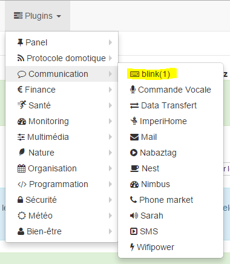

É assim que a página do plug-in blink (1) se parece (aqui com uma
equipamento) :

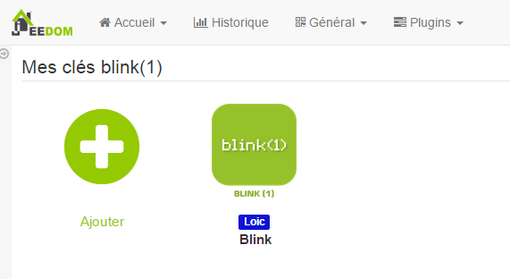

É assim que a página de configuração de um dispositivo intermitente se parece (1)
:

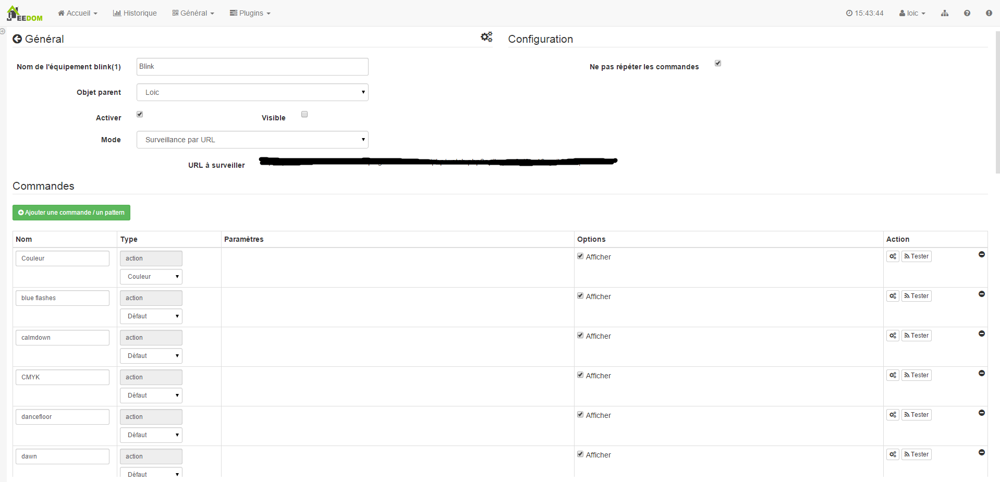

> **Dica**
>
> Como em muitos lugares em Jeedom, coloque o mouse na extremidade esquerda
> abre um menu de acesso rápido (você pode
> do seu perfil, deixe-o sempre visível).

Aqui você encontra toda a configuração do seu equipamento :

-   **Nome do equipamento intermitente (1)** : nome do seu equipamento de piscada (1)

-   **Objeto pai** : indica o objeto pai ao qual pertence
    o equipamento

-   **Ativar** : torna seu equipamento ativo

-   **Visivél** : torna visível no painel

-   **Modo** : o modo em que você deseja operar
    seu piscar (1) (veja a descrição abaixo)

Abaixo você encontra a lista de pedidos :

-   o nome exibido no painel

-   tipo e subtipo

-   o valor : permite dar o valor do pedido de acordo
    outro comando, uma chave (caso de um comutador virtual),
    de um cálculo….

-   Configurações : nome do padrão para ativar ou do comando para ativar

-   Display : permite exibir os dados no painel

-   configuração avançada (pequenas rodas dentadas) : permite exibir
    a configuração avançada do comando (método
    história, widget ...)

-   Teste : permite testar o comando

-   excluir (assinar -) : permite excluir o comando

Modo "Local"" 
============

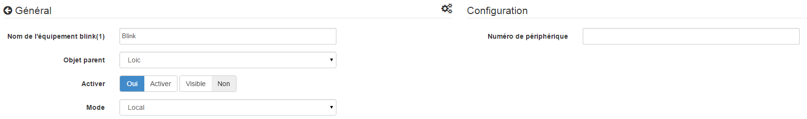

Modo a ser usado se o piscar (1) estiver conectado a uma das portas USB do
Jeedom. O único parâmetro neste modo não é obrigatório e permite
selecione um piscar de olhos (1) em particular se você tiver mais de um
na moda.

Modo de chamadas da API intermitente (1)" 
------------------------------

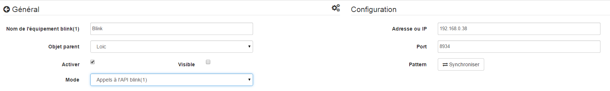

Nesse modo, o Jeedom chama diretamente a API blink1control,
Portanto, a Jeedom deve ser capaz de ingressar diretamente no sistema no qual
tecla intermitente (1) está instalada.

Neste modo, os parâmetros de configuração são :

-   **Endereço ou IP** : endereço ou ip em que a tecla intermitente (1) está instalada

-   **Porta** : porta na qual o aplicativo blink1control está escutando

-   **Padrão** : permite sincronizar os padrões com os de
    app blink1control

Instalação do aplicativo blink1control 
-------------------------------------------

O aplicativo blink1control pode ser encontrado
[aqui](http://blink1.thingm.com/blink1control/), na seção de download,
está disponível para windows e mac. Depois de baixado, inicie
instalando o aplicativo.

Configuração do aplicativo blink1control 
--------------------------------------------

Depois de instalado e iniciado, você deve ter :

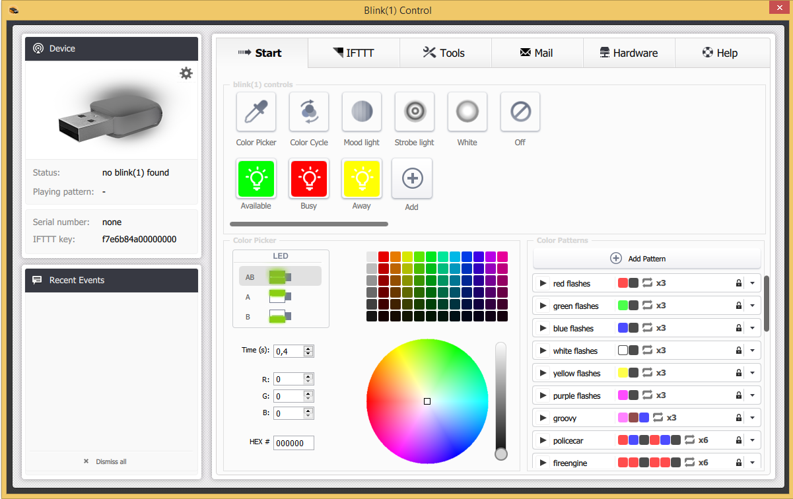

Esta aplicação oferece muitas possibilidades. Rapidamente nós
encontre na parte superior esquerda o status da chave (aqui não conectado), abaixo
eventos à esquerda, no topo, no centro de ações rápidas para
controle a tecla, logo abaixo de um sistema avançado de seleção de modo
e cores, e à direita os padrões.

Uma vez lá, clique na pequena roda dentada do dispositivo para
abra o menu de configuração avançada e ative a API
servidor, colocando serverHost em qualquer. Observe também a porta para o
relatório na configuração do Jeedom.

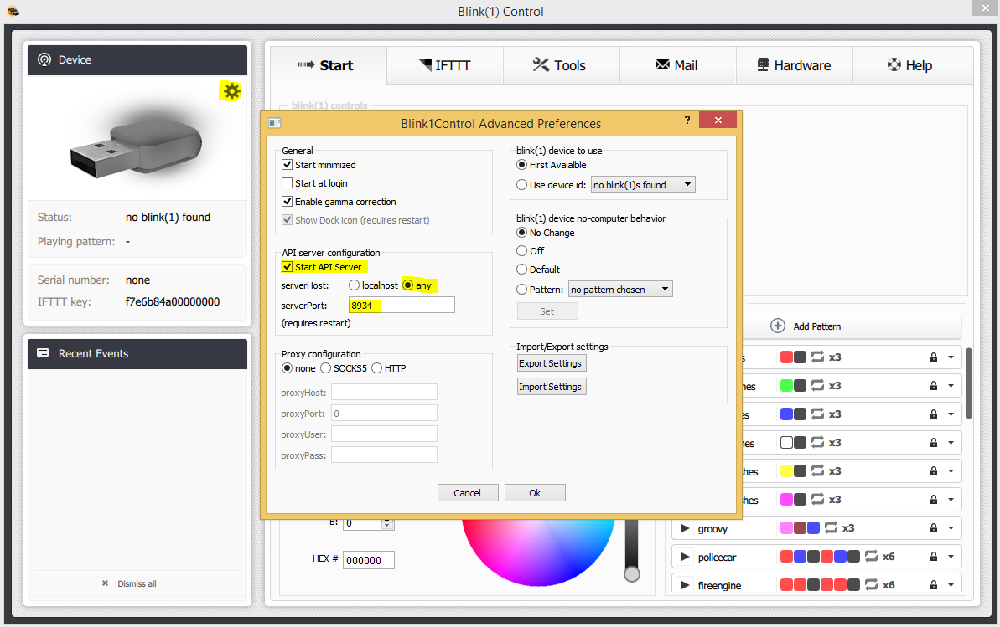

Valide e reinicie o blink1control para que ele leve em consideração.

"Modo de monitoramento de URL" 
===========================

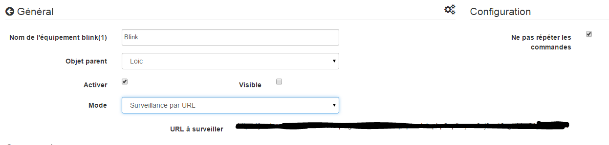

Nesse modo, é o aplicativo blink1control que chama todos os X
segundos este URL que lhe dará suas instruções.

Para configurá-lo, no aplicativo blink1control, vá para
ferramentas, clique no pequeno extra (+) para adicionar um,
crie URL e copie o URL fornecido pelo Jeedom (campos de URL a serem observados)
no caminho. Você também pode configurar a frequência de atualização.

> **IMPORTANTE**
>
> Para que isso funcione, o PC no qual o blink1control está instalado
> pode acessar o Jeedom. Se você usa um laptop fora
> da sua rede com a chave, portanto, o Jeedom deve ser
> acessível de fora. Se você não sabe como,
> melhor é usar o Jeedom DNS.

Nesse modo, você também tem a opção "Não repita comandos"
isso torna possível não repetir mais o último comando uma vez
blink1control levou em consideração a solicitação. É aconselhável
deixe marcado.

Modo "Ambos"" 
===============

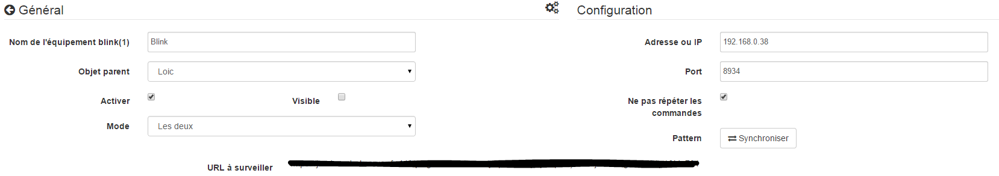

Este modo é uma combinação dos 2 modos anteriores, a vantagem é
que combina a velocidade de reação do primeiro e a possibilidade de
operar mesmo fora da segunda casa. Para o
configuração, siga os procedimentos para "Chamadas para
API blink (1) "e" Modo de monitoramento de URL".

Modo SSH" 
==========

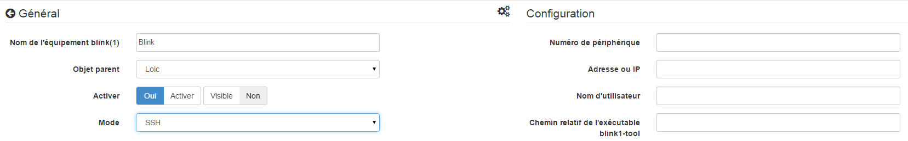

Este modo deve ser usado se você colocar o piscar (1) em uma máquina
Linux diferente daquele em que o Jeedom está instalado (Jeedom master porque o
plugin não é compatível no controle remoto). A configuração é bastante
simples :

-   **Número do dispositivo** : ID do dispositivo, a ser usado apenas se
    você tem várias teclas piscantes (1) em sua máquina

-   **Endereço ou IP** : Endereço IP da máquina em que a chave está conectada

-   **Nome de Usuário** : o nome de usuário para efetuar login
    a máquina onde a chave está conectada

-   **Caminho relativo do executável blink1-tool** : caminho relativo para
    o executável blink1-tool

> **Dica**
>
> O executável está disponível
> [aqui](https://github.com/todbot/blink1/releases), tenha cuidado Jeedom não
> só funciona com a versão linux que é obviamente compatível
> do que com uma máquina do tipo linux (rpi, rpi2, jeedomboard, cubieboard,
> bananapi…). Basta transferir o executável para a máquina onde
> está conectado à chave e o torna executável (chmod + x
> blink1-tool)

> **IMPORTANTE**
>
> Para que isso funcione, você deve ter implementado no nível SSH
> a troca de chaves RSA para que o Jeedom possa se conectar ao
> máquina onde a chave está conectada sem fornecer uma senha.
